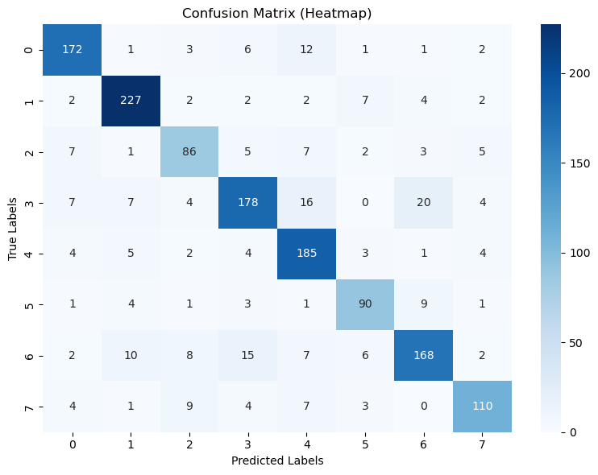

# Speech Emotion Recognition System 🎤

[](https://speech-emotion-recognition-vansh-187.streamlit.app/)

---

## 📖 Project Overview

This project implements a robust, end-to-end pipeline for emotion classification from speech data. Leveraging advanced audio processing techniques and a hybrid CNN-LSTM deep learning model, the system accurately identifies and categorizes emotional states conveyed in speech.

**Key Features:**
- Real-time emotion prediction from audio
- User-friendly Streamlit web app
- Supports 8 emotion categories
- Visualizes audio waveform and prediction confidence

---

## 🎵 Dataset

- **Source:** [RAVDESS Dataset](https://zenodo.org/record/1188976)
- **Speakers:** 24 (12 male, 12 female)
- **Emotions:** Neutral, Calm, Happy, Sad, Angry, Fearful, Disgust, Surprised
- **Samples:** 1440 speech files

---

## 🏗️ Model Pipeline

1. **Audio Preprocessing:**  
   - Downsampling, normalization, silence trimming

2. **Feature Extraction:**  
   - Chroma STFT
   - MFCCs
   - Zero Crossing Rate
   - Mel Spectrogram
   - RMS Energy

3. **Model Architecture:**  
   - 4-layer CNN for spatial feature extraction
   - Bidirectional LSTM for temporal modeling
   - Fully connected layers for classification

4. **Output:**  
   - One of 8 emotion classes

---

## 📊 Performance Metrics

| Metric            | Value   | 
|-------------------|---------|
| Overall Accuracy  | 82.61%   | 
| F1 Score          | 82.00%   | 
| Min Class Acc     | 74.14%   | 

**Confusion Matrix:**  



## 🚀 Getting Started

### 1. Clone the Repository

git clone https://github.com/Vansh-187/speech-emotion-recognition

cd speech-emotion-recognition


### 2. Local Installation
cd webapp
pip install -r requirements.txt
streamlit run app.py

### 3. Model Testing

python scripts/test.py 
paste the audio (.wav) file path in terminal

## 🌐 Web App Usage

1. Access the [hosted Streamlit app](https://speech-emotion-recognition-vansh-187.streamlit.app/)
2. Upload a WAV audio file
3. View the predicted emotion and audio visualization

## 🗂️ Repository Structure

```text
├── models/ # Trained model(s)
│ └── best_model.pth
├── notebooks/ # Jupyter notebook(s)
│ └── emotion_classification.ipynb
├── webapp/ # Streamlit web application
│ ├── app.py
│ └── requirements.txt
├── scripts/ # Testing script
│ └── test.py
├── images/ # Visualizations (e.g., confusion matrix)
├── LICENSE
└── README.md
```


## 🎥 Demo Video

[[Project Demo]](https://youtu.be/Fol85fDFNas?si=pkmoPpKLGKQZzi1I)


